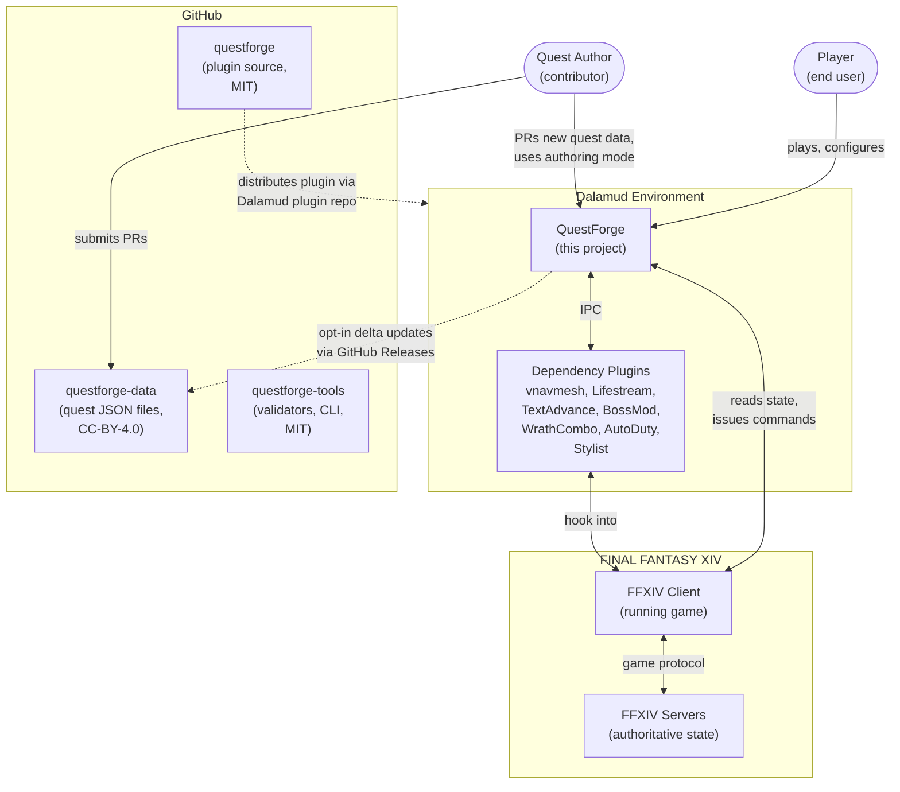
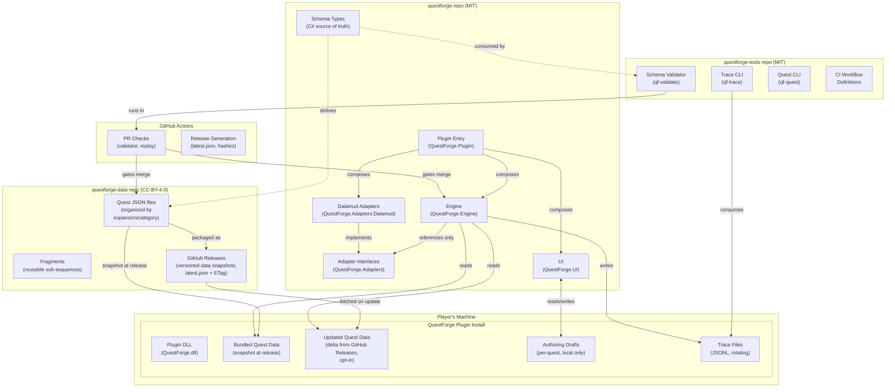
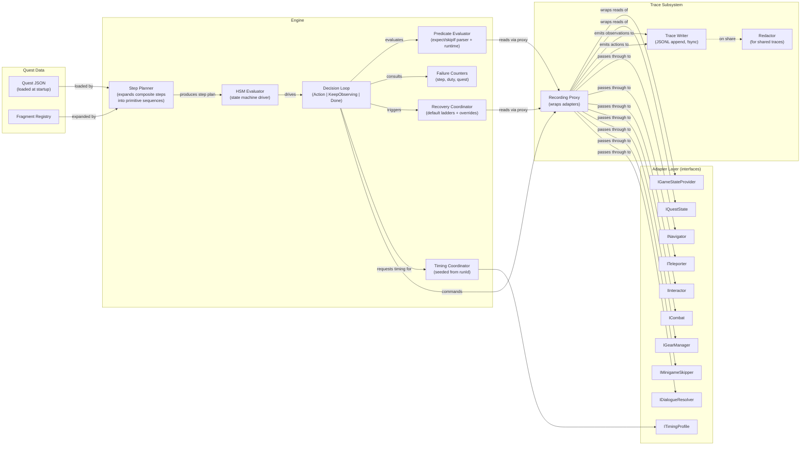
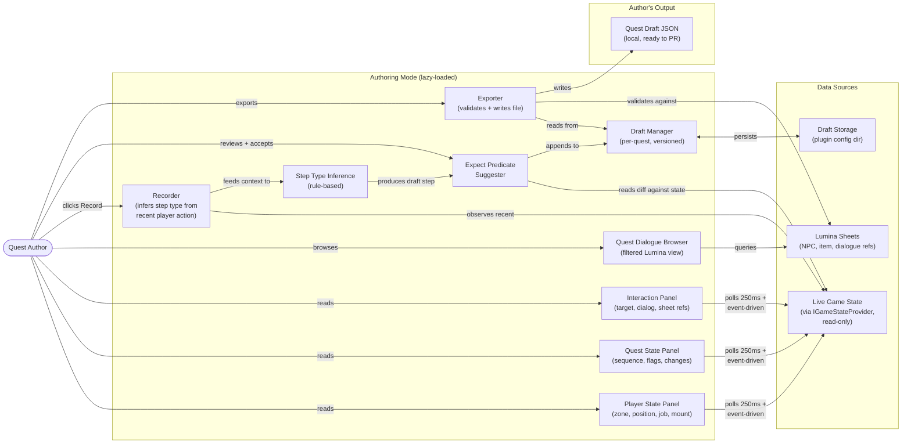
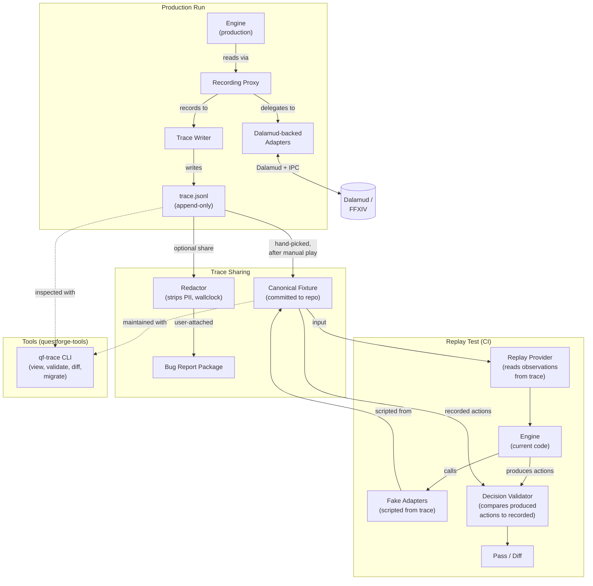

# QuestForge Architecture

**Status:** v1 draft — diagrams reflect the foundation design and will be revised as implementation surfaces what we got wrong
**Related:** [DESIGN.md](./DESIGN.md), [ADAPTERS.md](./ADAPTERS.md), [SCHEMA.md](./SCHEMA.md), [TRACE_FORMAT.md](./TRACE_FORMAT.md), [AUTHORING.md](./AUTHORING.md)

---

## About this document

C4-style architecture diagrams for QuestForge, at three levels of detail:

1. **System Context** — QuestForge and the world it lives in
2. **Container** — the three repos, CI, and how a plugin install fits together
3. **Component** — the engine, the adapter layer, and the supporting subsystems

Diagrams are in Mermaid, which renders natively on GitHub, GitLab, and most markdown viewers. To regenerate as images, see Mermaid Live Editor (https://mermaid.live).

This document is a navigational aid, not a contract. Where it conflicts with the prose specs, the prose specs win.

---

## Level 1: System Context

The widest view. Shows QuestForge in relation to the user, FFXIV, the dependent plugin ecosystem, and the data delivery infrastructure.

### What this shows

- QuestForge sits inside Dalamud, talking to FFXIV through both Dalamud's hooks and the dependency plugins
- The player is the primary user; the quest author is a secondary user who contributes data
- Three GitHub repositories with different licenses and audiences
- The data repo updates separately from the plugin (the hybrid delivery model in `DESIGN.md` §4)

### What this hides

- Internal QuestForge structure (next level)
- Specific IPC protocols with each dependency plugin
- Server-side mechanics (FFXIV is treated as a black box state provider)

---

## Level 2: Containers

A closer view of QuestForge and its repositories. Shows what artifacts exist, where they live, and how they relate.

### What this shows

- The plugin install on the user's machine bundles a data snapshot and may also fetch deltas
- The plugin DLL composes three layers: engine (pure), adapters (Dalamud-bound), UI (Dalamud-bound)
- The engine references *only* adapter interfaces, never concrete Dalamud types — this is the testability boundary
- Three separate CI flows: data PRs validated, engine PRs replay-tested, releases generated
- The schema is defined by C# types and consumed by both the runtime and the validator (single source of truth)

### What this hides

- Engine internals (next level)
- Specific adapter implementations (each adapter wraps different Dalamud primitives and IPC contracts)
- The recording proxy layer (it sits between engine and adapter implementations — shown in level 3)

---

## Level 3: Component — Engine

Zooming in on the QuestForge plugin itself. Shows the engine's internal structure and how it interacts with the adapter layer.

### What this shows

- The engine is composed of focused subsystems with one responsibility each
- The recording proxy sits between the engine and the adapter layer, capturing reads as observations and actions as events — this is what enables trace replay
- Reads flow through the proxy; writes (commands to adapters) also flow through the proxy to capture them in the trace
- Quest data is loaded and expanded by the planner before the HSM evaluator sees it
- Predicates are parsed once, evaluated against the proxy at runtime
- Failure counters are consulted by the decision loop, not maintained inside it

### What this hides

- Specific adapter implementations (each wraps different Dalamud primitives — see `ADAPTERS.md` §16)
- UI subsystems (settings, support status display, authoring panels — those are separate from the engine)
- The exact tick rate and async cancellation flow (these are engine-internal details)

---

## Level 3: Component — Authoring Mode

Authoring mode is separable enough to warrant its own component view. It's lazy-loaded and runs largely independently of the engine.

### What this shows

- Three debug panels are read-only consumers of game state
- The recorder is the central authoring action — observing state, inferring a step type, suggesting `expect`
- Authoring is mutually exclusive with the engine (the recorder consumes events the engine would otherwise consume)
- Drafts live locally with version history; export is a manual step that produces a PR-ready file
- The dialogue browser is a Lumina view, decoupled from recording

### What this hides

- The exact step type inference rules (those are heuristics, documented in `AUTHORING.md` §5.1)
- The UI rendering layer (ImGui via Dalamud)

---

## Level 3: Component — Trace & Replay

The trace subsystem deserves its own view because it spans recording and replay testing.

### What this shows

- The same `Engine` code path runs in both production and replay — only the adapter layer differs
- Recording happens transparently via the proxy in production
- Fixtures are *hand-picked* from production traces, not auto-generated — quality matters more than volume
- Replay does not re-run adapters against the game; it scripts fakes from the trace
- Bug reports are a separate path with explicit redaction

### What this hides

- The structure of individual trace events (see `TRACE_FORMAT.md` §5)
- The crash-safety protocol for trace writing (`TRACE_FORMAT.md` §9)

---

## Diagram maintenance

These diagrams are intentionally smaller than the prose specs. Two implications:

- **They will lie sometimes.** When a diagram conflicts with prose, the prose wins. When you notice a conflict, fix the diagram or remove it — outdated diagrams are worse than no diagrams.
- **They should be revised in the same PR that revises the corresponding prose.** Keep them in sync.

If the diagrams stop being useful, drop them. They're a navigation aid, not a deliverable.

---

## Appendix: What's deliberately not diagrammed

Decisions made about what to leave out and why:

- **Class diagrams** — premature; no implementation exists yet. The C# types defined in `ADAPTERS.md` and `SCHEMA.md` substitute.
- **Sequence diagrams of specific quest runs** — `TRACE_FORMAT.md` §A worked example is more useful than a diagram.
- **State machine diagrams of the HSM** — the HSM is small enough that the diagram would either be trivial or hand-wave too much. Prose in `DESIGN.md` §5.4 explains it.
- **Deployment diagrams** — there's only one deployment (Dalamud user installs the plugin). The system context diagram already shows this.
- **Database schema** — there's no database. Trace files are append-only JSONL; quest data is JSON files.

These can be added if a specific pain point emerges. Premature diagramming is a real cost.
